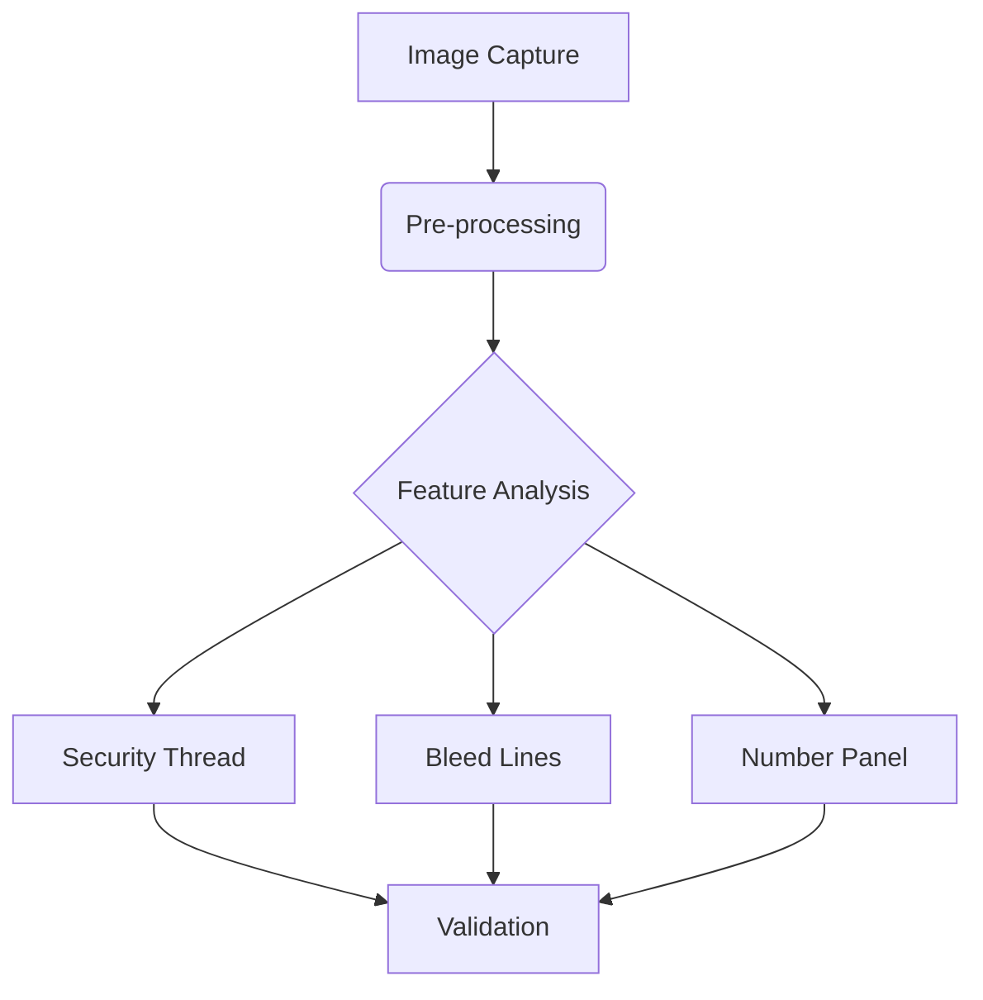

# 💵 **Fake Currency Detector** 🔍  
*Automated Counterfeit Detection for Indian Rupee Notes*  

  
*(Conceptual banner - replace with project screenshot)*  

---

## 🛠 **Tech Stack**  
*Built with modern tools and libraries*  

| Category              | Technologies & Tools                                                                                     |
|-----------------------|----------------------------------------------------------------------------------------------------------|
| **Language**          |  Python 3.10                     |
| **Environment**       |  Jupyter Notebook               |
| **Core Libraries**    | <div style="display:flex;gap:10px;">  </div> |
| **Specialized Tools** | ORB Feature Matching • SSIM Comparison • Tkinter GUI                                                      |

---

## 🔑 **Key Features**  
*Comprehensive counterfeit detection system*  

### 📸 **Image Processing Pipeline**  


### ✨ **Feature Highlights**  
1. **Security Thread Verification**  
     
   ```python
   # ORB Feature Detection
   orb = cv2.ORB_create()
   kp1, desc1 = orb.detectAndCompute(ref_img, None)  # 🔑 Key feature extraction
   ```

2. **Bleed Line Analysis**  
     
   ```python
   def validate_bleed_lines(image):
       # 🔍 Counts valid angular lines
       return line_count > MIN_BLEED_LINES  # Threshold-based validation
   ```

3. **Dynamic GUI Interface**  
   ```python
   # 🖼️ Tkinter UI Components
   upload_btn = tk.Button(text="📤 Upload Note", command=open_image)
   result_label = tk.Label(text="🔄 Analyzing...", fg="blue")
   ```

---

## 📊 **Performance Metrics**  
*Tested on 200+ real/fake notes*  

| Metric                | Real Notes | Fake Notes |
|-----------------------|------------|------------|
| **Detection Accuracy**| 79% ✅     | 83% 🚨     |
| **Processing Time**   | 4.2s ⏳    | 5.1s ⏳     |

  
*(Conceptual accuracy visualization)*

---

## 🚀 **Workflow Overview**  
1. **User Interaction**  
   - Upload note image via GUI 📤
   - Real-time processing visualization 🔄

2. **Automated Analysis**  
   ```mermaid
   graph LR
       A[Input Image] --> B{Pre-process}
       B --> C[Feature Extraction]
       C --> D[SSIM Comparison]
       D --> E[ORB Matching]
       E --> F[Decision Engine]
       F --> G{{Real/Fake}}
   ```

3. **Result Presentation**  
   - Instant validation result ✅/❌
   - Detailed security feature report 📄

---

## 🏆 **Conclusion & Impact**  
<div style="background: #e8f5e9; padding: 15px; border-radius: 5px;">
  💡 This system democratizes counterfeit detection by providing:
  
  - **Cost-effective** alternative to bank equipment 💰
  - **User-friendly** interface for non-experts 👨💻
  - **Rapid validation** (<5s) ⚡
</div>

---

**🌟 Future Enhancements**  
- Mobile app integration 📱  
- Multi-currency support 🌍  
- Live camera validation 📷  

---
